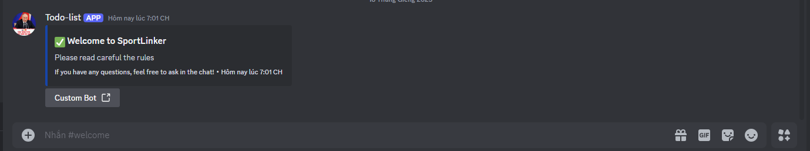

# Todo discord bot

Nodejs
Bot Discord

# Feature

- Interaction

- /task : create new task assign user and with date description time


- Event

- userJoin: create noti for user in the channel direct

  

# Requirement

node -v >= 20.6.0

# How to run

Create your .env file

```
SERVER_PORT=
BOT_TOKEN=
BOT_CLIENT_ID=
CHANNEL_WELCOME=
```

Then running terminal with

```bash

$ npm run start

```
