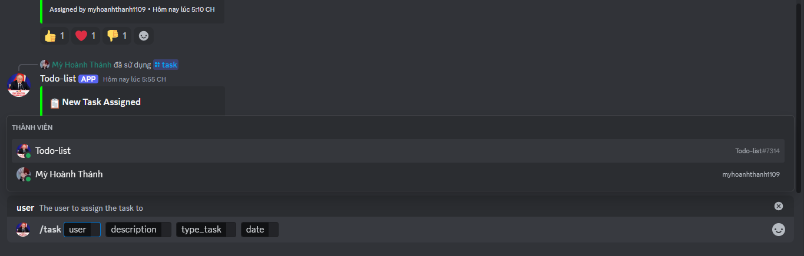
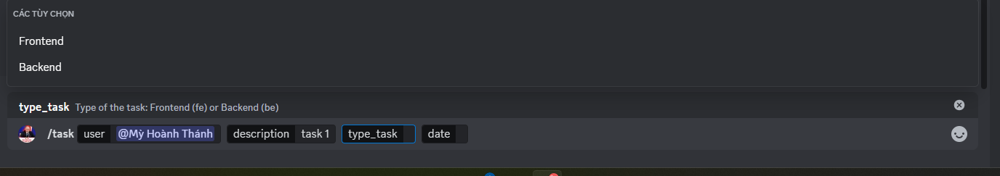
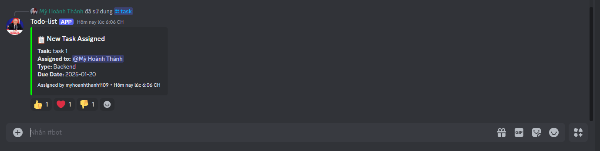

# Todo discord bot

Nodejs
Bot Discord

# Feature

- Interaction

- /task : create new task assign user and with date description time







- Event

- userJoin: create noti for user in the channel direct

# Requirement

node -v >= 20.6.0

# How to run

Create your .env file

```
BOT_TOKEN=          # Discord bot token
BOT_CLIENT_ID=      # Bot client id
SERVER_PORT=        # port of server running
channel_direct_id=  # channel u want bot reply to
```

Then running terminal with

```bash

$ npm run start

```
